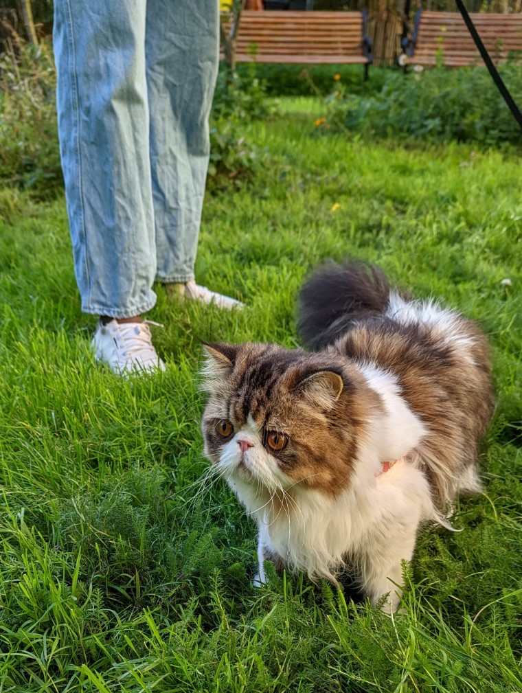

# Hi, I'm Simon (he/him) 👋👋👋

## I am...

🖥️ Learning to be a developer as a part of <a href="https://www.foundersandcoders.com/">Founders and Coders'</a> FAC27 cohort  
👨‍🏫 (Almost) an ex-teacher who is fascinated by the possibilities of EdTech to improve education  
🎹 A musician who loves to be creative and explore the intersection of tech and the arts  

## A photo of my cat

I was going to show it to you at some point anyway.

<!--
**simonryrie/simonryrie** is a ✨ _special_ ✨ repository because its `README.md` (this file) appears on your GitHub profile.

Here are some ideas to get you started:

- 🔭 I’m currently working on ...
- 🌱 I’m currently learning ...
- 👯 I’m looking to collaborate on ...
- 🤔 I’m looking for help with ...
- 💬 Ask me about ...
- 📫 How to reach me: ...
- 😄 Pronouns: ...
- ⚡ Fun fact: ...
-->
